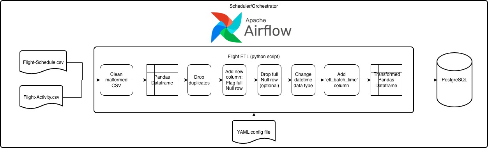

# Flight ETL

## Description
FlightETL is an ETL pipeline for flight data from local CSV file (in this case Flight-Activity.csv and Flight-Schedule.csv) into a postgresql database.
This ETL is designed for integration with Airflow. It includes a YAML configuration file and command-line options that can be parsed into Airflow DAGs.


## 1. module
- arg_parser.py: Provide a function parser() to parse arguments from CLI that return argument: table source name (correlated to config file)
- client.py: Provide class named Client that give functionalities to connect postgresql with python, engine connection, and disconnect postgresql with python
- job.py: Manage configuration settings for the jobs/tasks
- extractor.py: Extract data from csv, do initial csv cleaning format,change it to pandas dataframe (intermediary)
- transformer.py: Do necessary transformation for the dataframe such as dropping selected duplicate column, add new column is_null_row to flag full null row, change datatype into datetime, provide option to drop full null row.
- load.py: Load pandas dataframe to postgresql with 3 method: insert, append, replace. Add etl_batch_time column.
- log.py: Responsible for creation of loggers with both stream and file handlers
- util.py: Consist of several utility function for reading configuration files

## 2. source
- Source folder contains different table, in this case Flight-Activity.csv and Flight-Schedule.csv. 
- All resources available can be found under the directory:
  > `FlightETL/source/...`

# Installation
Use the package manager pip to install requirements with the following command:
 > `pip install -r requirements.txt`

or can be installed each module

## Usage
**1. Create resource (config)**
To create a new 'configuration'.yml under the following directory:

 > `FlightETL/configs/{source table}...`

Example for 'configuration'.yml:

```
---
TRANSFORM:
  drop_null: False
  enable_datetime_conversion: true
  datetime_columns:
      - sta
      - std

SINK:
- sink: postgresql
  key_column: act_id
  method: insert
  host: host.docker.internal
  port: 5432
  username: postgres
  password: postgresJeff14
  database: airport
  schema: flight
  table: flight_schedule
```

**2. Running the Task**

After creating configuration, run the following command:
 > `python3 main.py --job_id {source table in csv}`

Where:
 - `--job_id`: specifies the desired source table in csv

Example:
User want to create task to extract flight activity csv then run the following command:
 > `python3 main.py --job_id Flight-Activity.csv` 

The task will execute the task to do ETL from csv to postgresql.
